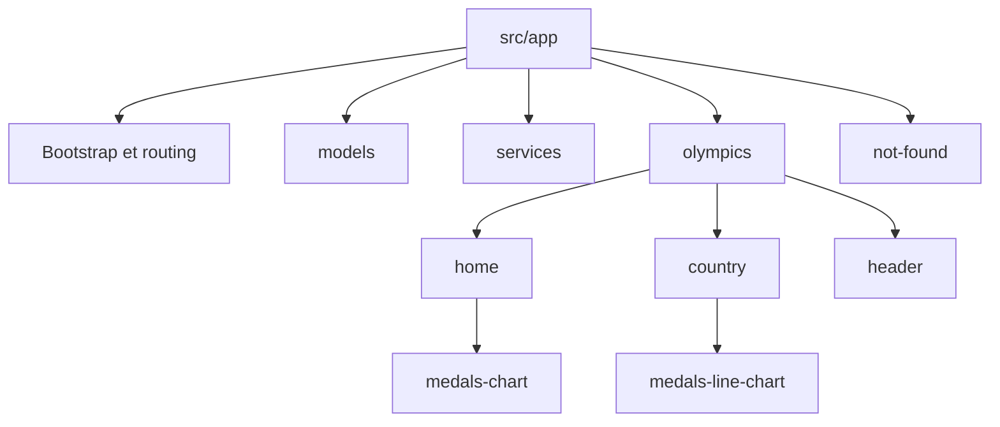
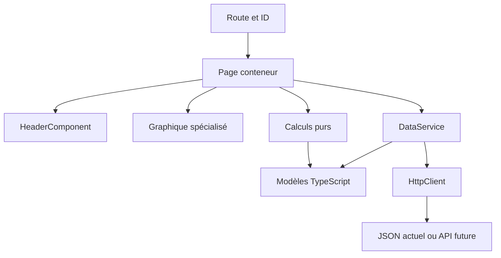

# Architecture proposée

Olympic Games / TéléSport.

## Contexte

Le starter audité utilise Angular core 18.2.13 avec NgModule, des pages sous src/app/pages, un JSON local et des appels HTTP dans HomeComponent et CountryComponent. Le PDF impose DataService, des interfaces TypeScript, HeaderComponent et une navigation par ID. L’utilisateur demande aussi standalone, pnpm et Angular 21.

Ce document décrit **l’état cible**, pas une architecture déjà implémentée. Le nom demandé pour ce fichier de travail est architecture.md. Le livrable canonique attendu par l’exercice est ARCHITECTURE.md.

## 1. Décision d’ensemble

Conserver les pages et leur présentation dans la fonctionnalité olympics. Placer les deux interfaces de données dans src/app/models et DataService dans src/app/services, conformément aux chemins explicites du PDF. Ce compromis est volontaire : la logique des pages reste organisée par fonctionnalité, avec une exception ciblée pour le contrat pédagogique.

Le projet reste une application de consultation de données olympiques. Pas de core/ vide, de shared/ global ou de couche Repository ajoutée sans responsabilité démontrée. Les modèles de données ne dépendent ni d’Angular ni de Chart.js.

Les noms HomeComponent et CountryComponent sont conservés et remplissent les rôles DashboardPage et CountryDetailPage décrits dans le PDF. Le PDF exige explicitement HeaderComponent et DataService, qui gardent ces noms.

## 2. Arborescence cible

| Chemin cible | Rôle et contenu |
| --- | --- |
| `src/main.ts` | Bootstrap standalone, traitement de l’échec de démarrage |
| `src/app/app.config.ts` | Providers de l’application : routing, HTTP et mode de détection conservé |
| `src/app/app.routes.ts` | Accueil, country/:id, not-found et wildcard |
| `src/app/app.component.*` | Coquille de l’application et router-outlet dans une structure sémantique |
| `src/app/models/participation.model.ts` | Contrat TypeScript d’une participation |
| `src/app/models/olympic.model.ts` | Pays, identifiant et participations |
| `src/app/services/data.service.ts` et `data.service.spec.ts` | Chargement centralisé et tests HTTP |
| `src/app/olympics/header/` | HeaderComponent et `indicator.model.ts`, partage limité à la fonctionnalité |
| `src/app/olympics/home/` | HomeComponent, dashboard et `home-statistics.ts` avec sa spec |
| `src/app/olympics/home/medals-chart/` | MedalsChartComponent pour les totaux par pays |
| `src/app/olympics/country/` | CountryComponent, route pays et `country-statistics.ts` avec sa spec |
| `src/app/olympics/country/medals-line-chart/` | MedalsLineChartComponent pour l’évolution annuelle |
| `src/app/not-found/` | NotFoundComponent et retour vers l’accueil |
| `src/assets/mock/olympic.json` | Source des données actuelle conservée |
| `src/environments/` | Configurations existantes, sans endpoint futur inventé |
| `src/polyfills.ts` et `src/test.ts` | Polyfills et bootstrap des tests à adapter selon les migrations réelles |
| `karma.conf.cjs` | Proposition de configuration du runner Node, à confirmer après diagnostic I04 |
| `pnpm-lock.yaml` | Résolution générée par pnpm après import, à versionner avec les manifestes |
| `.workspace/` et `compose.workspace.yaml` | Environnement de développement SSH existant |
| `README.md`, `notes-architecture.md`, `ARCHITECTURE.md` | Noms canoniques attendus au dépôt final |

Chaque composant regroupe ses fichiers `.component.ts`, `.component.html`, `.component.scss` et `.component.spec.ts`. Les tests restent près des sources. Les chemins ci-dessus sont **une cible proposée**, pas un inventaire de fichiers déjà créés dans l’application.



Schéma modifiable : [arborescence-cible-v3.drawio](arborescence-cible-v3.drawio). Les fichiers .component.* comprennent TypeScript, template, styles et test. Le tableau est la référence détaillée des chemins. Le diagramme présente la hiérarchie, pas les dépendances d’exécution.

Dans cette cible, app.module.ts et app-routing.module.ts disparaissent seulement lorsque leurs responsabilités ont été transférées. Le JSON et les environnements actuels restent présents. Les fichiers générés dist/ et node_modules/ ne sont pas des couches d’architecture.

## 3. Composants et responsabilités

| Composant | Rôle | Entrées / sorties proposées | Ce qu’il ne possède pas |
| --- | --- | --- | --- |
| AppComponent | Coquille sémantique et affichage des routes | RouterOutlet | Données olympiques, calculs |
| HomeComponent | Contexte, chargement du dashboard, KPI, composition et navigation | État depuis DataService, événements countrySelected | Instance Chart.js, URL HTTP |
| CountryComponent | ID depuis ActivatedRoute, sélection, état et présentation du pays | ID de route, données, retour accueil | Transport HTTP, moteur graphique |
| HeaderComponent | Afficher titre et indicateurs dans les deux pages | title: string, indicators: readonly Indicator[] | Service, routing ou calculs métier |
| MedalsChartComponent | Totaux par pays et sélection graphique | points contenant countryId/label/total, sortie countrySelected: number | Résolution du pays, navigation directe |
| MedalsLineChartComponent | Évolution annuelle du pays sélectionné | Série readonly year/medalsCount | Chargement et agrégation métier |
| NotFoundComponent | Message pour destination/pays introuvable et retour | RouterLink vers / | Chargement de données |

HeaderComponent est la réutilisation explicite requise. Les graphiques sont deux composants spécialisés. Ils ne sont pas présentés comme un composant générique partagé artificiellement.

**Cycle de vie Chart.js proposé :** l’instance appartient au composant qui possède le canvas. Elle est créée lorsque la vue existe, actualisée si les inputs changent et détruite avant abandon/remplacement du canvas. La durée de vie est testée. Les pages ne gardent pas de référence Chart.

## 4. Modèles et calculs

Contrats proposés, non compilés dans cette révision :

```typescript
export interface Participation {
  readonly id: number;
  readonly year: number;
  readonly city: string;
  readonly medalsCount: number;
  readonly athleteCount: number;
}

export interface Olympic {
  readonly id: number;
  readonly country: string;
  readonly participations: readonly Participation[];
}

export interface Indicator {
  readonly label: string;
  readonly value: number;
}
```

Participation et Olympic sont dans models/. Indicator appartient au dossier header/, car il décrit son contrat de présentation. Les imports entre ces fichiers doivent être explicites lors de l’implémentation.

| Calcul | Responsabilité proposée | Règle |
| --- | --- | --- |
| Nombre de pays | home-statistics.ts | Longueur de la collection de pays du contrat |
| Nombre de JO | home-statistics.ts | Nombre d’années distinctes sur toutes les participations |
| Totaux par pays | home-statistics.ts | Somme de medalsCount, conserver l’id du pays |
| Nombre de participations | country-statistics.ts | Longueur de participations |
| Total des médailles | country-statistics.ts | Somme numérique de medalsCount |
| Total des athlètes affiché | country-statistics.ts | Somme des effectifs athleteCount par édition, pas individus distincts |
| Évolution | country-statistics.ts | Années et médailles sur une copie triée, sans mutation du modèle |

Ces fonctions sont pures et testées sans TestBed. Des données de présentation spécifiques restent près de leur consommateur. Aucune arithmétique métier n’est déplacée dans HeaderComponent ou dans un callback Chart.js.

**Contradiction B02 :** le PDF demande aussi gold + silver + bronze, mais les modèles prescrits et le mock ne fournissent que medalsCount. La cible utilise le champ réellement disponible et documente l’écart. Aucun découpage par couleur n’est inventé.

## 5. DataService et portée de son injection

Chemin exigé : `src/app/services/data.service.ts`.

Contrat public proposé :

```typescript
getOlympics(): Observable<readonly Olympic[]>
```

Le service centralise la lecture du JSON actuel via HttpClient. HomeComponent et CountryComponent l’injectent. Aucun autre composant n’a besoin de connaître l’URL de transport. Les tableaux de données ne sont pas copiés en dur dans les pages.

La proposition utilise un provider à la racine de l’application. Il ne faut pas redéclarer DataService dans les providers des pages. Sa portée provient de la hiérarchie d’injection, pas d’une propriété intrinsèque « singleton » de toute classe Angular.

DataService ne calcule pas les KPI, ne navigue pas et ne choisit pas de messages de page. Il transmet les erreurs à la frontière qui peut les expliquer à l’utilisateur. Une erreur HTTP ne devient pas un succès vide.

Le service ne contient ni Subject, ni cache, ni persistance tant que ce besoin n’est pas démontré. Une instance de service partagée ne garantit pas une seule requête, chaque consommation du flux doit être comprise. L’implémentation doit éviter plusieurs abonnements accidentels au même chargement dans un template.

Tests attendus : résultat valide, erreur de transport, absence de requête inattendue, injection par les pages avec doubles de service. Le typage HttpClient ne valide pas à lui seul un payload inconnu au runtime.

## 6. Routing, état et concurrence

| Route cible | Page | Comportement |
| --- | --- | --- |
| / | HomeComponent | Chargement automatique du dashboard |
| /country/:id | CountryComponent | Lecture de paramMap, validation et recherche par Olympic.id |
| /not-found | NotFoundComponent | Pays ou destination introuvable |
| Toute route non reconnue | NotFoundComponent | Erreur de navigation et retour explicite |

La route existante country/:countryName est un fait du starter, pas la cible. Le passage à l’ID est une rupture d’URL identifiée dans I19/C19. Aucun alias de compatibilité n’est ajouté sans besoin établi.

Politique proposée pour un ID : entier positif sûr. Un ID invalide ou absent de la collection redirige vers not-found, avec remplacement de l’entrée invalide d’historique si cette option est retenue et testée. Une URL inconnue affiche la même page. Le retour de la page détail et des erreurs utilise routerLink="/".

L’état local de chaque page distingue chargement, données, vide et erreur. L’identité est portée par l’URL. Le flux de route est composé avec la lecture des données pour qu’une réponse ancienne ne remplace pas le pays courant. La gestion d’erreur appartient à chaque chargement afin qu’une navigation suivante reste possible.

AsyncPipe est proposé pour la consommation par le template. Si une subscription impérative est nécessaire, elle est bornée à la destruction via un mécanisme compatible avec la version installée, par exemple takeUntilDestroyed avec DestroyRef explicite. Pas de subscriptions imbriquées ni de Subject servant uniquement à reproduire l’état d’un Observable existant.

| Situation | Rendu attendu |
| --- | --- |
| Requête en cours | Squelette ou spinner, pas d’anciens KPI présentés comme actuels |
| Collection vide à l’accueil | Aucune donnée |
| Pays existant sans participations | Pays affiché, KPI à zéro et absence explicite de série |
| Erreur HTTP | Message compréhensible et retour, pas une 404 trompeuse |
| Pays inexistant / ID invalide | NotFoundComponent |
| Données valides | Header, graphique, alternative textuelle et navigation |

## 7. Patterns et frontières



Les flèches représentent les dépendances de consommation. Les détails du transport restent sous DataService. Les modèles et les calculs ne remontent aucune dépendance vers les pages.

| Élément | Nature | Utilité dans ce projet |
| --- | --- | --- |
| Service Layer léger | Frontière architecturale | Centraliser l’accès aux données |
| Conteneur / présentation | Organisation des responsabilités | Séparer chargement/navigation et affichage |
| Observable / composition RxJS | Modèle réactif, proche d’Observer | Gérer asynchronisme, annulation et durée de vie |
| DI Angular | Mécanisme du framework | Fournir les dépendances selon leur scope |
| Union discriminée d’état | Technique de typage | Empêcher des états UI contradictoires |
| Composants Chart.js dédiés | Encapsulation du rendu impératif | Isoler l’instance et son nettoyage |

**Repository n’est pas retenu.** Une source JSON et une future API ne démontrent pas à elles seules le besoin d’une interface repository et de plusieurs implémentations. DataService représente déjà la frontière utile. Réexaminer si des règles de persistance, des sources substituables ou un domaine indépendant du transport imposent un contrat supplémentaire.

**Facade, Strategy, Factory, Command, State GoF, Proxy, Decorator GoF et store global** ne sont pas des objectifs d’implémentation. Leur introduction doit expliquer un problème que le code actuel ne résout pas simplement. Les décorateurs Angular, la DI et les interceptors ne doivent pas être assimilés automatiquement à ces patterns.

**core/** reste absent. Un dossier global ne serait justifié que par des responsabilités réellement transverses et stables. Authentification, session, error handling global ou interceptors ne sont pas ajoutés au titre d’une API encore inconnue.

## 8. Préparation à une API future

| Élément conservable | Adaptation éventuelle lorsque le contrat existe |
| --- | --- |
| Pages, HeaderComponent et graphiques | Conserver leurs contrats de présentation si les besoins restent identiques |
| DataService | Remplacer l’appel au JSON par le transport réel |
| Modèles Olympic/Participation | Les faire évoluer uniquement selon une décision de contrat |
| Frontière de données | Ajouter un mapping DTO → modèle si les champs réels diffèrent |
| Gestion des états | Traduire les erreurs connues sans les masquer |
| Tests | Doubler le service dans les pages et vérifier le nouveau contrat à la frontière |

Un mapping de DTO peut jouer le rôle d’Adapter si une différence réelle de contrat le justifie. Ne pas ajouter un adapter vide, un repository générique, un endpoint fictif ou une variable d’environnement anticipée.

Pagination, cache, invalidation, retry, timeout, authentification et autorisation seront des décisions fondées sur les exigences du backend. Une autorisation frontend ne protège pas le serveur. Aucun secret ne doit être livré dans le bundle. L’exercice exclut la persistance serveur réelle et la gestion de rôles.

## 9. Responsive, maquettes et accessibilité

| Contexte | Exigence du PDF | Validation attendue |
| --- | --- | --- |
| Desktop ≥1200 px | Grille 12 colonnes, contenus côte à côte | KPI, graphiques et commandes lisibles |
| Tablette 768–1199 px | Grille 8 colonnes, graphique pleine largeur | Aucun débordement ni commande masquée |
| Mobile ≤767 px | Grille 4 colonnes, empilement vertical | Navigation utilisable et valeurs lisibles |

Contrôler chaque page et ses états, y compris not-found. Ajouter une description et une alternative HTML aux graphiques. La sélection de pays reste possible par des liens clavier. Garder des contrastes AA, un focus visible, un nom pour les boutons/icônes et une hiérarchie de titres cohérente.

**B01 ouvert :** le PDF montre et demande un pie chart, mais la grille mentionne un bar chart. MedalsChartComponent conserve un nom indépendant du type. L’hypothèse provisoire est pie, sans déclarer la case bar chart satisfaite. Une décision peut changer la configuration de ce composant dans un correctif dédié.

Le détail utilise une évolution line, compatible avec les choix textuels du PDF. Ne pas recopier les valeurs illustratives des maquettes dans les données.

## 10. Socle standalone et migrations

La cible standalone répartit la composition dans :

- src/main.ts pour bootstrapApplication et le traitement d’erreur de démarrage
- app.config.ts pour provideRouter, provideHttpClient et le mode de détection conservé
- app.routes.ts pour les routes
- chaque composant pour ses imports de template

Le plan commence par établir la validation sous Angular 18. Le passage standalone est fait à version constante, suivi des déplacements et changements fonctionnels. Les majeures 19, 20 et 21 sont ensuite des paliers isolés.

La cible initiale Angular 21 conserve explicitement la détection avec Zone.js afin de ne pas cumuler une migration zoneless. Le bootstrap de tests garde ses dépendances tant qu’il les importe. Karma/Jasmine reste la stack de référence tant que sa compatibilité est vérifiée. Ni standalone ni Angular 21 n’autorise à supprimer automatiquement les dépendances du runner.

Les packages @angular/forms, @angular/animations, @angular/platform-server et @types/express sont retirés séparément après contrôle. @types/jest est un candidat supplémentaire confirmé seulement si le dépôt réel n’a pas acquis de tests Jest. Les dépendances conservées sont toutes examinées et mises à jour dans les plages compatibles.

pnpm importe d’abord le lockfile npm. Son remplacement, l’épinglage de l’outil, les adaptations du workspace et du README.

## 11. Validation et livraison

Tests ciblés dans les commits : calculs, HTTP, HeaderComponent, routing/ID, erreurs, durée de vie et événements graphiques. Contrôles de navigateur pour rendu, navigation, clavier et responsive. Après chaque migration, installation figée, build, tests, ng serve et inspection du diff.
