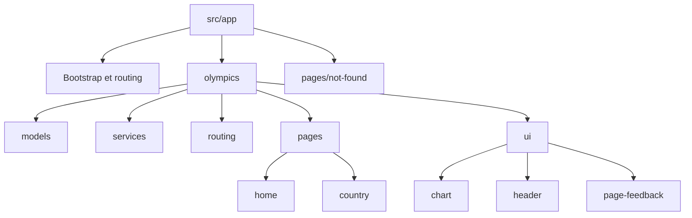
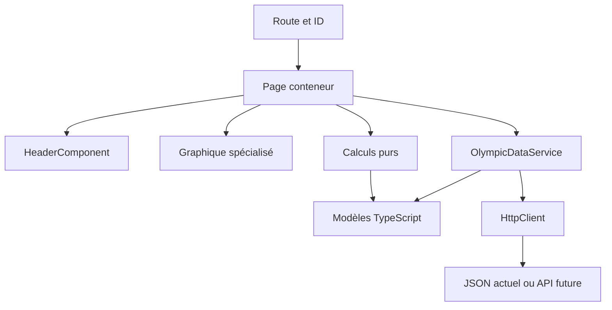

# Architecture

Olympic Games / TéléSport.

## Contexte

L’application utilise Angular 21 standalone, pnpm, un JSON local et une fonctionnalité Olympics regroupant les pages, le modèle et l’accès aux données. Les graphiques, l’en-tête et les retours d’état sont également regroupés dans cette fonctionnalité.

Ce document décrit l’architecture implémentée dans `src/`.

## 1. Décision d’ensemble

Regrouper les pages Olympics, leurs modèles, leurs calculs et leur accès aux données sous `src/app/olympics/`. La page `not-found` reste sous `src/app/pages/`, car elle est commune aux routes inconnues et aux pays absents.

Le projet reste une application de consultation de données olympiques. Pas de core/ vide, de shared/ global ou de couche Repository ajoutée sans responsabilité démontrée. Les modèles de données ne dépendent ni d’Angular ni de Chart.js.

Les noms HomeComponent et CountryComponent sont conservés et remplissent les rôles DashboardPage et CountryDetailPage décrits dans le PDF. Le PDF exige explicitement HeaderComponent et un service de données, implémenté ici par OlympicDataService.

## 2. Arborescence actuelle

| Chemin actuel                                       | Rôle et contenu                                                          |
| --------------------------------------------------- | ------------------------------------------------------------------------ |
| `src/main.ts`                                       | Bootstrap standalone, traitement de l’échec de démarrage                 |
| `src/app/app.config.ts`                             | Providers de l’application : routing, HTTP et détection zoneless         |
| `src/app/app.routes.ts`                             | Accueil, country/:id, not-found et wildcard                              |
| `src/app/app.component.*`                           | Coquille de l’application et router-outlet dans une structure sémantique |
| `src/app/olympics/models/`                          | Interfaces métier Olympics                                               |
| `src/app/olympics/services/`                        | Chargement, cache, validation et erreurs de données                      |
| `src/app/olympics/ui/`                              | Graphique, en-tête et retours d’état présentés par les pages             |
| `src/app/olympics/pages/home/`                      | HomeComponent et projection du dashboard                                 |
| `src/app/olympics/pages/country/`                   | CountryComponent et projection de la fiche pays                          |
| `src/app/olympics/routing/`                         | Routes et parsing des paramètres de la fonctionnalité Olympics           |
| `src/app/pages/not-found/`                          | NotFoundComponent et retour vers l’accueil                               |
| `src/assets/mock/olympic.json`                      | Source des données actuelle conservée                                    |
| `src/environments/`                                 | Configurations existantes, sans endpoint futur inventé                   |
| `src/polyfills.ts` et `src/testing/vitest.setup.ts` | Polyfills applicatifs et APIs DOM manquantes dans jsdom                  |
| `vitest-base.config.ts`                             | Configuration du runner Vitest Node/jsdom                                |
| `pnpm-lock.yaml`                                    | Lockfile pnpm versionné avec le manifeste                                |
| `README.md` et `docs/architecture/`                 | Documentation du projet et décisions d’architecture                      |

Les composants regroupent leurs fichiers près de la source et les tests restent à côté du code. `PageFeedbackComponent` utilise toutefois un template inline et des styles inline complémentaires.



Schéma modifiable : [arborescence-cible.drawio](arborescence-cible.drawio). Le tableau est la référence détaillée des chemins. Le diagramme présente la hiérarchie, pas les dépendances d’exécution.

L’application actuelle est standalone : `app.module.ts` et `app-routing.module.ts` sont absents. Le JSON et les environnements actuels restent présents. Les fichiers générés dist/ et node_modules/ ne sont pas des couches d’architecture.

## 3. Composants et responsabilités

| Composant             | Rôle                                                              | Entrées / sorties                                               | Ce qu’il ne possède pas              |
| --------------------- | ----------------------------------------------------------------- | --------------------------------------------------------------- | ------------------------------------ |
| AppComponent          | Coquille sémantique et affichage des routes                       | RouterOutlet                                                    | Données olympiques, calculs          |
| HomeComponent         | Contexte, chargement du dashboard, KPI, composition et navigation | État depuis OlympicDataService, événements countrySelected      | Instance Chart.js, URL HTTP          |
| CountryComponent      | ID depuis ActivatedRoute, sélection, état et présentation du pays | ID de route, données, retour accueil                            | Transport HTTP, moteur graphique     |
| HeaderComponent       | Afficher titre et indicateurs dans les deux pages                 | title: string, indicators: readonly Indicator[]                 | Service, routing ou calculs métier   |
| OlympicChartComponent | Rendu du graphique de médailles en camembert ou en courbe         | type, items et dataDescriptionId ; sortie pointSelected: number | Chargement, agrégation et navigation |
| NotFoundComponent     | Message pour destination/pays introuvable et retour               | RouterLink vers /                                               | Chargement de données                |

HeaderComponent est la réutilisation explicite requise. `OlympicChartComponent` encapsule les deux rendus Chart.js actuels : camembert pour l’accueil et courbe pour le détail pays.

**Cycle de vie Chart.js actuel :** l’instance appartient au composant qui possède le canvas. Elle est créée lorsque la vue existe, actualisée si les inputs changent et détruite avant abandon/remplacement du canvas. La durée de vie est testée. Les pages ne gardent pas de référence Chart.

## 4. Modèles et calculs

Contrats actuellement compilés dans l’application :

```typescript
export interface Participation {
  readonly id: number;
  readonly year: number;
  readonly city: string;
  readonly medalsCount: number;
  readonly athleteCount: number;
}

export interface Olympic {
  readonly id: number;
  readonly country: string;
  readonly participations: readonly Participation[];
}

export interface Indicator {
  readonly kind: 'countries' | 'editions' | 'entries' | 'medals' | 'athletes';
  readonly label: string;
  readonly value: number;
}
```

Participation et Olympic sont dans models/. Indicator appartient au dossier header/, car il décrit son contrat de présentation. Les imports entre ces fichiers doivent être explicites lors de l’implémentation.

| Calcul                     | Responsabilité actuelle | Règle                                                                 |
| -------------------------- | ----------------------- | --------------------------------------------------------------------- |
| Nombre de pays             | home-view-model.ts      | Longueur de la collection de pays du contrat                          |
| Nombre de JO               | home-view-model.ts      | Nombre d’années distinctes sur toutes les participations              |
| Totaux par pays            | home-view-model.ts      | Somme de medalsCount, conserver l’id du pays                          |
| Nombre de participations   | country-view-model.ts   | Longueur de participations                                            |
| Total des médailles        | country-view-model.ts   | Somme numérique de medalsCount                                        |
| Total des athlètes affiché | country-view-model.ts   | Somme des effectifs athleteCount par édition, pas individus distincts |
| Évolution                  | country-view-model.ts   | Années et médailles sur une copie triée, sans mutation du modèle      |

Ces fonctions sont pures et testées sans TestBed. Des données de présentation spécifiques restent près de leur consommateur. Aucune arithmétique métier n’est déplacée dans HeaderComponent ou dans un callback Chart.js.

**Contradiction B02 :** le PDF demande aussi gold + silver + bronze, mais les modèles prescrits et le mock ne fournissent que medalsCount. L’implémentation actuelle utilise le champ réellement disponible et documente l’écart. Aucun découpage par couleur n’est inventé.

## 5. OlympicDataService et portée de son injection

Chemin : `src/app/olympics/services/olympic-data.service.ts`.

Contrat public actuel :

```typescript
getOlympics(): Observable<readonly Olympic[]>
```

Le service centralise la lecture du JSON actuel via HttpClient. HomeComponent et CountryComponent l’injectent. Aucun autre composant n’a besoin de connaître l’URL de transport. Les tableaux de données ne sont pas copiés en dur dans les pages.

Le service utilise un provider à la racine de l’application. Il ne faut pas le redéclarer dans les providers des pages. Sa portée provient de la hiérarchie d’injection, pas d’une propriété intrinsèque « singleton » de toute classe Angular.

OlympicDataService ne calcule pas les KPI, ne navigue pas et ne choisit pas de messages de page. Il transmet les erreurs à la frontière qui peut les expliquer à l’utilisateur. Une erreur HTTP ne devient pas un succès vide.

Le service utilise un cache mémoire partagé avec `shareReplay({ bufferSize: 1, refCount: true })` : une réponse réussie est réutilisée, une erreur permet une nouvelle tentative et un chargement sans consommateur est annulé. Il ne contient ni Subject ni persistance.

Tests attendus : résultat valide, erreur de transport, absence de requête inattendue, injection par les pages avec doubles de service. Le typage HttpClient ne valide pas à lui seul un payload inconnu au runtime.

## 6. Routing, état et concurrence

| Route actuelle           | Page              | Comportement                                                |
| ------------------------ | ----------------- | ----------------------------------------------------------- |
| /                        | HomeComponent     | Chargement automatique du dashboard                         |
| /country/:id             | CountryComponent  | Lecture de paramMap, validation et recherche par Olympic.id |
| /not-found               | NotFoundComponent | Pays ou destination introuvable                             |
| Toute route non reconnue | NotFoundComponent | Erreur de navigation et retour explicite                    |

La route actuelle utilise déjà `country/:id`. Aucun alias `country/:countryName` n’est conservé.

L’ID doit être un entier positif sûr. Un ID invalide ou absent de la collection redirige vers not-found avec remplacement de l’entrée invalide d’historique (`replaceUrl: true`). Une URL inconnue affiche la même page. Le retour de la page détail et des erreurs utilise routerLink="/".

L’état local de chaque page distingue chargement, données, vide et erreur. L’identité est portée par l’URL. Le flux de route est composé avec la lecture des données pour qu’une réponse ancienne ne remplace pas le pays courant. La gestion d’erreur appartient à chaque chargement afin qu’une navigation suivante reste possible.

Les pages utilisent des subscriptions impératives bornées à la destruction avec `takeUntilDestroyed` et `DestroyRef`. `AppComponent` utilise également des signals pour l’état dérivé de la navigation. Il n’y a pas d’AsyncPipe pour ces flux et pas de subscriptions imbriquées.

| Situation                         | Rendu attendu                                                   |
| --------------------------------- | --------------------------------------------------------------- |
| Requête en cours                  | Squelette ou spinner, pas d’anciens KPI présentés comme actuels |
| Collection vide à l’accueil       | Aucune donnée                                                   |
| Pays existant sans participations | Pays affiché, KPI à zéro et absence explicite de série          |
| Erreur HTTP                       | Message compréhensible et retour, pas une 404 trompeuse         |
| Pays inexistant / ID invalide     | NotFoundComponent                                               |
| Données valides                   | Header, graphique, alternative textuelle et navigation          |

## 7. Patterns et frontières



Les flèches représentent les dépendances de consommation. Les détails du transport restent sous OlympicDataService. Les modèles et les calculs ne remontent aucune dépendance vers les pages.

| Élément                       | Nature                            | Utilité dans ce projet                          |
| ----------------------------- | --------------------------------- | ----------------------------------------------- |
| Service Layer léger           | Frontière architecturale          | Centraliser l’accès aux données                 |
| Conteneur / présentation      | Organisation des responsabilités  | Séparer chargement/navigation et affichage      |
| Observable / composition RxJS | Modèle réactif, proche d’Observer | Gérer asynchronisme, annulation et durée de vie |
| DI Angular                    | Mécanisme du framework            | Fournir les dépendances selon leur scope        |
| Union discriminée d’état      | Technique de typage               | Empêcher des états UI contradictoires           |
| Composants Chart.js dédiés    | Encapsulation du rendu impératif  | Isoler l’instance et son nettoyage              |

**Repository n’est pas retenu.** Une source JSON et une future API ne démontrent pas à elles seules le besoin d’une interface repository et de plusieurs implémentations. OlympicDataService représente déjà la frontière utile. Réexaminer si des règles de persistance, des sources substituables ou un domaine indépendant du transport imposent un contrat supplémentaire.

**Facade, Strategy, Factory, Command, State GoF, Proxy, Decorator GoF et store global** ne sont pas des objectifs d’implémentation. Leur introduction doit expliquer un problème que le code actuel ne résout pas simplement. Les décorateurs Angular, la DI et les interceptors ne doivent pas être assimilés automatiquement à ces patterns.

**core/** reste absent. Un dossier global ne serait justifié que par des responsabilités réellement transverses et stables. Authentification, session, error handling global ou interceptors ne sont pas ajoutés au titre d’une API encore inconnue.

## 8. Préparation à une API future

| Élément conservable                  | Adaptation éventuelle lorsque le contrat existe                                 |
| ------------------------------------ | ------------------------------------------------------------------------------- |
| Pages, HeaderComponent et graphiques | Conserver leurs contrats de présentation si les besoins restent identiques      |
| OlympicDataService                   | Remplacer l’appel au JSON par le transport réel                                 |
| Modèles Olympic/Participation        | Les faire évoluer uniquement selon une décision de contrat                      |
| Frontière de données                 | Ajouter un mapping DTO → modèle si les champs réels diffèrent                   |
| Gestion des états                    | Traduire les erreurs connues sans les masquer                                   |
| Tests                                | Doubler le service dans les pages et vérifier le nouveau contrat à la frontière |

Un mapping de DTO peut jouer le rôle d’Adapter si une différence réelle de contrat le justifie. Ne pas ajouter un adapter vide, un repository générique, un endpoint fictif ou une variable d’environnement anticipée.

Le cache mémoire actuel est limité à la lecture partagée du JSON. Pagination, invalidation, retry, timeout, authentification et autorisation seront des décisions fondées sur les exigences du backend. Une autorisation frontend ne protège pas le serveur. Aucun secret ne doit être livré dans le bundle. L’exercice exclut la persistance serveur réelle et la gestion de rôles.

## 9. Responsive, maquettes et accessibilité

| Contexte             | Exigence du PDF                             | Validation attendue                       |
| -------------------- | ------------------------------------------- | ----------------------------------------- |
| Desktop ≥1200 px     | Grille 12 colonnes, contenus côte à côte    | KPI, graphiques et commandes lisibles     |
| Tablette 768–1199 px | Grille 8 colonnes, graphique pleine largeur | Aucun débordement ni commande masquée     |
| Mobile ≤767 px       | Grille 4 colonnes, empilement vertical      | Navigation utilisable et valeurs lisibles |

Contrôler chaque page et ses états, y compris not-found. Ajouter une description et une alternative HTML aux graphiques. La sélection de pays reste possible par des liens clavier. Garder des contrastes AA, un focus visible, un nom pour les boutons/icônes et une hiérarchie de titres cohérente.

**B01 résolu dans l’implémentation actuelle :** l’accueil utilise un pie chart et le détail pays une line chart via `OlympicChartComponent`. Le PDF mentionne aussi un bar chart, mais aucun bar chart n’est implémenté.

Le détail utilise une évolution line, compatible avec les choix textuels du PDF. Ne pas recopier les valeurs illustratives des maquettes dans les données.

## 10. Socle standalone actuel

Le socle standalone actuel répartit la composition dans :

- src/main.ts pour bootstrapApplication et le traitement d’erreur de démarrage
- app.config.ts pour provideRouter, provideHttpClient et provideZonelessChangeDetection
- app.routes.ts pour les routes
- chaque composant pour ses imports de template

L’application est actuellement sous Angular 21 et le passage standalone est déjà effectué. Les routes Olympics sont lazy-loadées via `olympics.routes.ts`.

L’application utilise `provideZonelessChangeDetection()`. Les tests unitaires
utilisent le builder `@angular/build:unit-test` avec Vitest et jsdom dans Node.js,
sans navigateur. `canvas` fournit le contexte 2D nécessaire aux tests Chart.js.

Les packages @angular/forms, @angular/animations, @angular/platform-server, @types/express et @types/jest ne sont pas présents dans le `package.json` actuel. Les dépendances Angular, Chart.js, RxJS, Vitest/jsdom et Playwright constituent le socle conservé.

Le dépôt utilise pnpm, avec `packageManager: pnpm@12.10.1` et `pnpm-lock.yaml` versionné.

## 11. Validation et livraison

La validation actuelle couvre les calculs, HTTP, HeaderComponent, routing/ID, erreurs, durée de vie et événements graphiques. Les contrôles E2E et navigateur vérifient aussi le rendu, la navigation, le clavier et le responsive. Les scripts de référence sont `pnpm typecheck`, `pnpm lint`, `pnpm test`, `pnpm build` et `pnpm test:e2e`.
