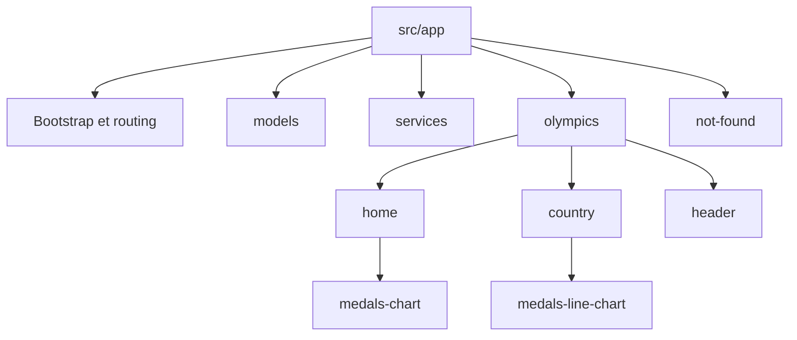

# Notes d’architecture historiques

Projet Olympic Games / TéléSport

**Statut : archive du starter et des travaux proposés à cette époque.**

L’architecture implémentée et les décisions actuelles sont décrites dans
[architecture.md](architecture.md). Les versions, problèmes et tâches ci-dessous
sont des constats historiques et ne constituent pas une liste de travaux restants.

### Sources et périmètre

| Réf. | Source identifiable | Ce qu’elle établit                               |
| ---- | ------------------- | ------------------------------------------------ |
| P1   | Repository github   | 46 fichiers, sources et configuration du starter |

### État technique établi

| Élément                     | Fait du snapshot                                                      | Source                                 |
| --------------------------- | --------------------------------------------------------------------- | -------------------------------------- |
| Angular core / compiler-cli | 18.2.13 verrouillé                                                    | package-lock.json                      |
| Angular CLI / build-angular | 18.2.20 verrouillé                                                    | package-lock.json                      |
| TypeScript / RxJS           | 5.4.5 / 7.8.2                                                         | package-lock.json                      |
| Chart.js / Zone.js          | 4.5.0 / 0.14.10                                                       | package-lock.json                      |
| Jasmine / Karma             | 5.1.2 / 6.4.4                                                         | package-lock.json                      |
| Architecture                | AppModule et AppRoutingModule, quatre composants                      | src/main.ts et src/app/                |
| Route détail                | country/:countryName                                                  | app-routing.module.ts                  |
| Gestionnaire                | package-lock.json et commandes npm                                    | manifeste et README                    |
| Typage                      | strict et strictTemplates activés, any explicites présents            | tsconfig.json et composants            |
| Environnement               | node:22-bookworm, workspace SSH                                       | .workspace/ et compose.workspace.yaml  |
| Données                     | JSON local, HTTP dupliqué dans Home/Country                           | composants et assets/mock/olympic.json |
| Tests                       | Bootstrap importe platform-browser-dynamic/testing et zone.js/testing | src/test.ts                            |

Les versions sont des résolutions de lockfile, pas des versions exécutées. Aucun node_modules ni dossier .git n’est fourni. L’inventaire complet des dépendances et leur traitement sont dans issues-commits.md.

### Données vérifiables du mock

|  ID | Pays          | Participations | Médailles cumulées | Effectifs cumulés |
| --: | ------------- | -------------: | -----------------: | ----------------: |
|   1 | Italy         |              3 |                 96 |              1128 |
|   2 | Spain         |              3 |                 54 |               948 |
|   3 | United States |              3 |                345 |              1888 |
|   4 | Germany       |              3 |                125 |              1272 |
|   5 | France        |              3 |                113 |              1238 |

**Source :** agrégation Python exécutée sur `src/assets/mock/olympic.json`. Il contient 5 pays, 15 participations et les années 2012, 2016, 2020.

**Limite :** les participations contiennent `id`, `year`, `city`, `medalsCount` et `athleteCount`. Aucun champ par couleur de médaille ni identité d’athlète n’existe. Les chiffres des maquettes illustrent une disposition, ils ne remplacent pas les données du JSON.

## Contraintes fonctionnelles et traçabilité

| Repère | Exigence                                                   | Source                                     | Réponse cible proposée                                                             | Travail                      |
| ------ | ---------------------------------------------------------- | ------------------------------------------ | ---------------------------------------------------------------------------------- | ---------------------------- |
| F01    | Dashboard accessible par défaut, contexte de l’application | PDF p. 2–3                                 | HomeComponent dans olympics/home                                                   | I18/I20/I37                  |
| F02    | Nombre de pays et nombre de JO présents dans les données   | PDF p. 6                                   | KPI par HeaderComponent, années distinctes de tous les pays                        | I17/I18                      |
| F03    | Total de médailles par pays, toutes éditions confondues    | PDF p. 3/6                                 | Agrégation de medalsCount disponible, réserve B02                                  | I17/I21                      |
| F04    | Type de graphique du dashboard                             | PDF p. 3/6 et grille front étape 1         | B01 ouvert, pie proposé provisoirement, pas de conformité totale annoncée          | I01/I21/I40                  |
| F05    | Clic sur un pays puis /country/:id                         | PDF p. 5–7                                 | Événement countryId, routage par Olympic.id                                        | I19/I21/I23                  |
| F06    | ID récupéré avec ActivatedRoute                            | Grille front étape 2                       | paramMap observé, conversion contrôlée et recherche par id                         | I19                          |
| F07    | Accès direct, ID invalide, pays absent et mauvaise URL     | PDF p. 4/7 et grille front                 | NotFoundComponent, aucune exception ni ancien pays affiché                         | I19/I20                      |
| F08    | Détail : pays, participations, médailles et athlètes       | PDF p. 4/6                                 | HeaderComponent, effectifs cumulés sans prétendre compter les personnes distinctes | I17/I18                      |
| F09    | Évolution des médailles par édition                        | PDF p. 4/6                                 | MedalsLineChartComponent, années ordonnées, valeurs numériques                     | I17/I22                      |
| F10    | Retour explicite vers l’accueil                            | PDF p. 6                                   | routerLink="/" sur détail, erreurs et not-found                                    | I19/I20                      |
| F11    | Chargement, vide et erreur visibles                        | PDF p. 6                                   | Spinner/squelette, Aucune donnée, message clair et retour                          | I20                          |
| F12    | HeaderComponent partagé réellement utilisé                 | PDF p. 6 et grille architecture étape 3    | Titre et liste typée label/value, consommés par les deux pages                     | I18                          |
| F13    | DataService et interfaces aux chemins prescrits            | PDF p. 5 et grille architecture étapes 4–5 | src/app/services/data.service.ts et src/app/models/                                | I15/I16                      |
| F14    | Responsive desktop, tablette et mobile                     | PDF p. 6 et les deux grilles               | Seuils et dispositions explicités, contrôles sur chaque page                       | I25/I37                      |
| F15    | Accessibilité                                              | PDF p. 6                                   | Contrastes AA, focus, noms des contrôles et alternative textuelle aux graphes      | I23/I24/I25                  |
| F16    | Qualité, nettoyage, zéro any et cycle de vie               | PDF p. 7 et les deux grilles               | Typage, erreurs explicites, destruction Chart/Observable, code mort retiré         | I04/I15/I20/I21/I22/I26      |
| F17    | Tests réels, ng serve et démonstration                     | Les deux grilles                           | Baseline puis preuves par commit et validation finale                              | I03/I04/I05/I06/I37          |
| F18    | Documentation, diagramme et historique                     | PDF p. 7 et les deux grilles               | README, notes-architecture.md, ARCHITECTURE.md, draw.io, commits atomiques         | I38/I39 et toutes les issues |
| U01    | Pages par fonctionnalité                                   | Demande utilisateur du 02/10/2026          | olympics/home et olympics/country, partagé local dans olympics/header              | I14/I18                      |
| U02    | NgModule → standalone                                      | Demande utilisateur du 02/10/2026          | bootstrapApplication, app.config.ts et app.routes.ts                               | I13                          |
| U03    | npm → pnpm                                                 | Demande utilisateur du 02/10/2026          | Import du lockfile et gestionnaire épinglé                                         | I12                          |
| U04    | Retrait de quatre dépendances nommées                      | Demande utilisateur du 02/10/2026          | Un commit cohérent par suppression après vérification                              | I07/I08/I09/I10              |
| U05    | Angular 18 → 21 et examen des autres dépendances           | Demande utilisateur du 02/10/2026          | Paliers 18 → 19 → 20 → 21, inventaire exhaustif                                    | I27–I35                      |
| U06    | Commits avec scope et reprise maîtrisée                    | Demande utilisateur du 02/10/2026          | Conventional Commits, dépendances de contenu et de contexte indiquées              | issues-commits.md            |

### Décisions fixées par les sources

- Les pages sont organisées dans `olympics/home` et `olympics/country`, conformément à P5.
- Les chemins `src/app/models/` et `src/app/services/data.service.ts` sont imposés par P3. Ils constituent une exception documentée au regroupement de tous les fichiers dans la fonctionnalité. Les noms génériques n’autorisent pas un service fourre-tout.
- `HeaderComponent` affiche un titre et des indicateurs typés dans les deux pages.
- La cible utilise `country/:id` et `ActivatedRoute`. Le contrat invalide/pays absent est `not-found`.
- Le retour utilise `routerLink="/"`. Les anciennes questions Q01 et Q02 ne sont plus ouvertes.
- Angular 21, standalone et pnpm sont dans le scope de planification, alors que la v2 les excluait.

### Contradictions et hypothèses visibles

| Repère | Sources distinctes                                                                       | Traitement proposé                                                                                                                                        | Ce qui reste non validé                                                       |
| ------ | ---------------------------------------------------------------------------------------- | --------------------------------------------------------------------------------------------------------------------------------------------------------- | ----------------------------------------------------------------------------- |
| B01    | PDF p. 3 : bar ou pie. PDF p. 6 et maquette p. 3 : pie. Autoévaluation front : bar chart | Nom neutre MedalsChartComponent. Hypothèse de travail : pie selon le PDF, arbitrage à consigner en I01. I40 seulement si un changement de type est requis | Conformité simultanée aux deux consignes impossible à affirmer sans arbitrage |
| B02    | PDF p. 6 : total gold + silver + bronze. PDF p. 5 et mock : seulement medalsCount        | Somme de medalsCount, seul total disponible. Signaler l’écart dans le bilan. Ne pas inventer de détail par couleur                                        | La décomposition par couleur et la validation de cette formule                |
| B03    | KPI total d’athlètes demandé. Mock sans identifiants de personnes                        | Somme de athleteCount par participation, avec explication « effectifs cumulés par édition »                                                               | Nombre de personnes distinctes impossible à déterminer                        |

**Données insuffisantes** pour attribuer des noms d’athlètes, créer des endpoints backend, fixer les patches futurs ou annoncer que tous les critères sont satisfaits.

## Problèmes catégorisés et priorisés

### Registre des constats applicatifs

Les colonnes **Catégories** et **Priorité proposée** relèvent de l’analyse d’impact, pas de faits runtime mesurés. Un constat peut appartenir à plusieurs catégories. Le classement et les lots de traitement figurent dans la synthèse de priorité et issues-commits.md. **N/C** désigne un constat non classé comme défaut à corriger.

| Code | Catégories                                         | Priorité proposée | Fait confirmé dans le snapshot                                                                                                                                                                                        | Source                                                                                                                                                                 | Limite ou conséquence à vérifier                                                                                                                                                                      |
| ---- | -------------------------------------------------- | ----------------- | --------------------------------------------------------------------------------------------------------------------------------------------------------------------------------------------------------------------- | ---------------------------------------------------------------------------------------------------------------------------------------------------------------------- | ----------------------------------------------------------------------------------------------------------------------------------------------------------------------------------------------------- |
| A01  | Routing · gestion des absences                     | P1                | `find()` est suivi d’un accès direct à `selectedCountry.country`, sans contrôle d’absence.                                                                                                                            | `src/app/pages/country/country.component.ts:29-32`.                                                                                                                    | Le chemin de code pour un pays absent n’est pas protégé. Aucun crash n’a été reproduit dans un navigateur pendant cette révision.                                                                     |
| A02  | Routing · synchronisation de l’état                | P1                | `paramMap` met seulement à jour une variable locale. La requête et les agrégats sont lancés dans une autre subscription au `ngOnInit`.                                                                                | `src/app/pages/country/country.component.ts:24-45`.                                                                                                                    | Aucun recalcul n’est déclenché par une émission ultérieure du paramètre dans cette méthode. Le scénario de navigation entre deux pays sur la même instance reste à tester.                            |
| A03  | Routing · navigation                               | P1 à vérifier     | Les liens « Go back » utilisent `routerLink=""`.                                                                                                                                                                      | `src/app/pages/country/country.component.html:27-29`, `src/app/pages/not-found/not-found.component.html:1-4`.                                                          | Ils n’expriment pas un retour absolu à `/`. La navigation relative documentée par Angular [S3] motive un test ciblé. Ne pas certifier le retour à l’accueil sur la seule présence d’un élément `<a>`. |
| A04  | État UI · erreurs · résilience                     | P1                | Les erreurs HTTP sont stockées dans `error`, absent des templates. Aucun état explicite de chargement ou de résultat vide n’est rendu.                                                                                | Les deux composants métier et leurs templates.                                                                                                                         | Absence de traitement visible dans le code. Latence, messages et transitions réels non observés.                                                                                                      |
| A05  | Cycle de vie · ressources                          | P2                | Chaque page instancie un `Chart`. Aucun appel `destroy()` ni `ngOnDestroy` n’est présent dans ces composants.                                                                                                         | `src/app/pages/home/home.component.ts:40-67`, `src/app/pages/country/country.component.ts:48-66`.                                                                      | Le nettoyage requis par Chart.js n’est pas explicite [S9]. Aucune fuite mémoire n’est mesurée.                                                                                                        |
| A06  | Typage · contrats de données                       | P1 contrat        | Les données HTTP sont typées `any[]`. `totalEntries` est `any`. Médailles et effectifs passent inutilement par des chaînes avant sommation.                                                                           | `src/app/pages/home/home.component.ts:22-30`, `src/app/pages/country/country.component.ts:14-38`.                                                                      | Le JSON inspecté contient des nombres. Un build n’a pas été exécuté pour quantifier les diagnostics après retrait des `any`.                                                                          |
| A07  | Duplication · placement du code                    | P2                | L’URL `./assets/mock/olympic.json` et l’accès HTTP sont dupliqués dans les deux pages.                                                                                                                                | `src/app/pages/home/home.component.ts:12,19-22`, `src/app/pages/country/country.component.ts:13,21-27`.                                                                | Le nombre de transferts réseau effectifs et le cache navigateur ne sont pas mesurés. Un service unique ne constituerait pas automatiquement un cache.                                                 |
| A08  | Structure · placement du code · simplification     | P2                | Les pages mélangent agrégats, état d’affichage et construction Chart.js. On trouve aussi un `pipe()` vide, un `map` identité et un `.flat()` après `flatMap`.                                                         | `src/app/pages/home/home.component.ts:22-31`, `src/app/pages/country/country.component.ts:27-39`.                                                                      | Ce sont des candidats à simplification. Aucun gain de performance chiffré n’est établi.                                                                                                               |
| A09  | Accessibilité · interaction · données alternatives | P1                | La navigation vers un pays est codée dans le clic du camembert. Aucun lien HTML de pays n’est fourni sur la home. Les canvas interpolent les instances Chart.                                                         | `src/app/pages/home/home.component.ts:54-61`, `src/app/pages/home/home.component.html:19`, `src/app/pages/country/country.component.html:23`.                          | Aucune alternative structurée équivalente n’est définie dans ces templates. Un audit clavier et lecteur d’écran reste nécessaire.                                                                     |
| A10  | Accessibilité · sémantique HTML                    | P2                | `AppComponent` ne rend qu’un `router-outlet`. Aucun `main` ni `h1` n’est présent. Le titre du document est statique.                                                                                                  | `src/app/app.component.html`, templates des trois pages, `src/index.html:5`, routing sans `title`.                                                                     | Corriger la sémantique doit tenir compte du rendu et du parcours. Aucun taux de conformité n’en est déduit.                                                                                           |
| A11  | Styles · responsive · accessibilité                | P1 contrat        | Les styles définissent blanc sur `#0b868f`, du texte `gray`, une rangée `.split` sans `flex-wrap` et une 404 en `100vw`/`100vh`.                                                                                      | `src/styles.scss:6-43`, `src/app/pages/country/country.component.scss:8-12`, `src/app/pages/not-found/not-found.component.scss:1-8`.                                   | Les contrastes calculables sont détaillés plus bas. Débordement, dimensions réelles et reflow restent à vérifier dans le navigateur.                                                                  |
| A12  | Hygiène du code · journalisation                   | P3                | La home journalise le JSON complet. `Router` est injecté sans usage dans la page country. `.heading` n’apparaît que dans sa déclaration SCSS.                                                                         | `src/app/pages/home/home.component.ts:24`, `src/app/pages/country/country.component.ts:3,21`, `src/styles.scss:2-4` et recherche dans `src/`.                          | Nettoyage ciblé. Ne pas retirer le `console.error` de bootstrap par assimilation avec un log de debug.                                                                                                |
| A13  | Tests · validation                                 | P1 validation     | Les specs des pages ne vérifient que leur création. Les `TestBed` de home et country n’apportent pas les dépendances HTTP/routing correspondantes. Les templates avec `routerLink` ne sont pas testés comme parcours. | `src/app/pages/home/home.component.spec.ts:9-22`, `src/app/pages/country/country.component.spec.ts:10-23`, `src/app/pages/not-found/not-found.component.spec.ts:9-22`. | Constats de configuration et de couverture écrite, pas résultats d’exécution ni pourcentage de couverture.                                                                                            |

### Registre de l’outillage, de la documentation et de la sécurité

| Code | Catégories                              | Priorité proposée           | Fait confirmé                                                                                                                                                                                                             | Source                                                                                     | Limite ou conséquence à vérifier                                                                                                                                                                            |
| ---- | --------------------------------------- | --------------------------- | ------------------------------------------------------------------------------------------------------------------------------------------------------------------------------------------------------------------------- | ------------------------------------------------------------------------------------------ | ----------------------------------------------------------------------------------------------------------------------------------------------------------------------------------------------------------- |
| A14  | Outillage · configuration des tests     | P1 validation               | Angular pointe sur `karma.conf.ts`. Le lockfile ne contient ni `ts-node` ni `@types/karma`. La configuration mélange imports Node, `require` et `module.exports`.                                                         | `angular.json:86-102`, `karma.conf.ts:5-71`, lockfile.                                     | Karma documente une transpilation TypeScript via `ts-node` [S10]. Chargement de configuration et compatibilité de modules sont des prérequis à valider. Aucun message d’échec Karma n’est inventé.          |
| A15  | Environnement · tests · documentation   | P1 validation, conditionnel | Le Dockerfile du workspace n’installe pas Chrome/Chromium. L’entrypoint termine par `sshd` et ne lance ni `npm ci` ni `ng serve`.                                                                                         | `.workspace/Dockerfile:1-31`, `.workspace/entrypoint.sh:1-32`.                             | Les programmes effectivement présents dans une image construite n’ont pas été inspectés. L’automatisation décrite dans le README n’apparaît pas dans ces fichiers.                                          |
| A16  | Documentation · reproductibilité        | P1 équipe                   | Le README documente `docker/compose.yaml`, le service `frontend`, des Dev Containers et une image Nginx absents de l’archive. Il dit `AppComponent.title` absent alors que cette propriété existe.                        | `README.md:13-115`, inventaire, `src/app/app.component.ts:9`.                              | La documentation ne peut pas servir telle quelle de procédure vérifiée pour ce snapshot.                                                                                                                    |
| A17  | Outillage · qualité statique            | P2                          | Aucun script `lint` ni configuration ESLint n’est fourni. L’extension VS Code est recommandée.                                                                                                                            | `package.json:4-10`, inventaire, `.vscode/extensions.json:4`, `.vscode/settings.json:2-8`. | L’extension ne prouve pas une exécution de lint. Un contrôle distant non fourni reste inconnu.                                                                                                              |
| A18  | Traçabilité · Git · périmètre d’audit   | N/C — limite                | Aucun dossier `.git`, workflow `.github` ou fichier `.gitlab-ci.yml` n’est embarqué. Aucune Issue ou PR n’est fournie.                                                                                                    | Inventaire complet de l’archive.                                                           | Impossible d’établir branches, commits, working tree, protections ou CI distante à partir de ce ZIP.                                                                                                        |
| A19  | Maintenance · dépendances · sécurité    | P1 production, conditionnel | Les versions Angular verrouillées appartiennent à une majeure hors support.                                                                                                                                               | Lockfile et documentation de support [S2].                                                 | Ce fait ne prouve pas une vulnérabilité exploitable précise. Audit de dépendances et migration sont des travaux distincts.                                                                                  |
| A20  | Sécurité · contrôle statique            | N/C — constat favorable     | La recherche dans les sources applicatives n’a trouvé aucune occurrence de `innerHTML`, `bypassSecurityTrust`, `eval(`, `localStorage` ou `sessionStorage`. Les environnements ne définissent qu’un booléen `production`. | Recherche ciblée dans `src/`, `src/environments/environment*.ts`.                          | Ce contrôle de motifs n’est ni un audit XSS complet ni un scan exhaustif de secrets. Aucune garantie globale de sécurité n’en découle.                                                                      |
| A21  | Sécurité · configuration du workspace   | N/C — protections présentes | La configuration SSH refuse root et les mots de passe, autorise l’utilisateur `node` et le forwarding TCP. Les ports publiés par Compose sont liés à `127.0.0.1`.                                                         | `.workspace/sshd_config:3-13`, `compose.workspace.yaml:17-19`.                             | Cela décrit les fichiers, pas l’état du pare-feu, de la VM, du réseau ou d’un service réellement lancé.                                                                                                     |
| A22  | Environnement · prérequis local         | N/C — prérequis normal      | Compose attend `.workspace/authorized_keys`, absent du ZIP et explicitement ignoré par Git.                                                                                                                               | `compose.workspace.yaml:35-36`, `.gitignore`, inventaire.                                  | C’est un prérequis local à documenter. Son absence dans l’archive n’est pas une preuve de mauvaise gestion de secrets.                                                                                      |
| A23  | Dépendances · hygiène                   | P2 demandé                  | `@angular/forms`, `@angular/animations`, `@angular/platform-server`, `@types/jest` et `@types/express` sont déclarés sans usage direct trouvé dans le code applicatif. Les specs demandent les types Jasmine.             | `package.json`, imports applicatifs, `tsconfig.spec.json:6-8`.                             | Le retrait de forms, animations, platform-server et @types/express est maintenant demandé. @types/jest reste à confirmer. Vérifier les usages indirects et l’installation/build/tests avant chaque retrait. |
| A24  | Performance · chargement                | P3 conditionnel             | Les pages sont référencées directement dans le routing et importent `chart.js/auto`.                                                                                                                                      | `src/app/app-routing.module.ts`, imports des composants.                                   | Aucun problème de temps de chargement ni gain de tree-shaking n’a été mesuré.                                                                                                                               |
| A25  | Logique métier · sémantique des données | P2 clarification            | La somme des `athleteCount` est affichée comme « Total Number of athletes ». Le JSON n’identifie pas les personnes.                                                                                                       | `src/app/pages/country/country.component.ts:37-38`, template:16-17, mock.                  | La métrique calculée est vérifiable, son interprétation comme nombre de personnes distinctes ne l’est pas. Décision de libellé à faire valider.                                                             |

### Priorités révisées selon le contrat

La priorité est une appréciation d’impact et d’ordre de travail. Elle n’est ni une mesure d’incident ni une note de développeur.

| Niveau                     | Problèmes ou obligations                                                             | Traitement                                             |
| -------------------------- | ------------------------------------------------------------------------------------ | ------------------------------------------------------ |
| P1 prérequis               | Chaîne de validation non établie, environnement, tests, versions exécutées inconnues | I02–I06 avant migration                                |
| P1 fonctionnel             | Route ID, absence/erreurs, agrégats, composants requis, données centralisées         | I15–I22                                                |
| P1 accessibilité/livraison | Accès clavier aux données, responsive prescrit, preuves et README                    | I23/I25/I37–I39                                        |
| P1 modernisation demandée  | pnpm, standalone, cible Angular 21                                                   | I12/I13/I27–I30, séparés des changements métier        |
| P2 maintenabilité          | Placement par fonctionnalité, sémantique, gestion et actualisation des dépendances   | I14/I24/I31–I35                                        |
| P2 demandé                 | Suppression des quatre packages identifiés                                           | I07–I10, contrôles préalables et un commit par retrait |
| P3 résiduel/conditionnel   | Types Jest inutilisés, nettoyage restant, optimisation sans mesure                   | I11/I26, A24 reste conditionnel                        |

A18, A20, A21 et A22 ne sont pas transformés en défauts fictifs. Le manque d’historique est une limite d’audit, les protections observées sont à conserver et authorized_keys est un prérequis local.

## Architecture cible et justification

**Choix proposé :** présentation par fonctionnalité, modèles et service aux chemins pédagogiques imposés. Pas de niveau features/ supplémentaire, de shared/ global, de core/ artificiel ou de Repository ajouté pour afficher un niveau d’expertise.

| Chemin cible                                                              | Rôle et contenu                                                               |
| ------------------------------------------------------------------------- | ----------------------------------------------------------------------------- |
| `src/main.ts`                                                             | Bootstrap standalone, traitement de l’échec de démarrage                      |
| `src/app/app.config.ts`                                                   | Providers de l’application : routing, HTTP et mode de détection conservé      |
| `src/app/app.routes.ts`                                                   | Accueil, country/:id, not-found et wildcard                                   |
| `src/app/app.component.*`                                                 | Coquille de l’application et router-outlet dans une structure sémantique      |
| `src/app/models/participation.model.ts`                                   | Contrat TypeScript d’une participation                                        |
| `src/app/models/olympic.model.ts`                                         | Pays, identifiant et participations                                           |
| `src/app/services/data.service.ts` et `data.service.spec.ts`              | Chargement centralisé et tests HTTP                                           |
| `src/app/olympics/header/`                                                | HeaderComponent et `indicator.model.ts`, partage limité à la fonctionnalité   |
| `src/app/olympics/home/`                                                  | HomeComponent, dashboard et `home-statistics.ts` avec sa spec                 |
| `src/app/olympics/home/medals-chart/`                                     | MedalsChartComponent pour les totaux par pays                                 |
| `src/app/olympics/country/`                                               | CountryComponent, route pays et `country-statistics.ts` avec sa spec          |
| `src/app/olympics/country/medals-line-chart/`                             | MedalsLineChartComponent pour l’évolution annuelle                            |
| `src/app/not-found/`                                                      | NotFoundComponent et retour vers l’accueil                                    |
| `src/assets/mock/olympic.json`                                            | Source des données actuelle conservée                                         |
| `src/environments/`                                                       | Configurations existantes, sans endpoint futur inventé                        |
| `src/polyfills.ts` et `src/test.ts`                                       | Polyfills et bootstrap des tests à adapter selon les migrations réelles       |
| `karma.conf.cjs`                                                          | Proposition de configuration du runner Node, à confirmer après diagnostic I04 |
| `pnpm-lock.yaml`                                                          | Résolution générée par pnpm après import, à versionner avec les manifestes    |
| `.workspace/` et `compose.workspace.yaml`                                 | Environnement de développement SSH existant                                   |
| `README.md`, `docs/architecture/notes-architecture.md`, `ARCHITECTURE.md` | Noms canoniques attendus au dépôt final                                       |

Chaque composant regroupe ses fichiers `.component.ts`, `.component.html`, `.component.scss` et `.component.spec.ts`. Les tests restent près des sources. Les chemins ci-dessus sont **une cible proposée**, pas un inventaire de fichiers déjà créés dans l’application.

Le schéma modifiable est fourni dans `arborescence-cible-v3.drawio` (fichier absent du dépôt actuel). Il décrit la cible après standalone et les refactorings. Le dessin précédent reste historique et n’est plus la référence de cette cible. Les anciens comptes « 61 fichiers cibles » ne sont pas repris.

### Responsabilités et dépendances

| Bloc                   | Responsabilité                                                      | Dépendances autorisées                                                   | À exclure                                                   |
| ---------------------- | ------------------------------------------------------------------- | ------------------------------------------------------------------------ | ----------------------------------------------------------- |
| HomeComponent          | Charger, présenter le contexte/KPI et naviguer par ID               | DataService, calculs purs, HeaderComponent, MedalsChartComponent, Router | HTTP direct, propriété de l’instance Chart                  |
| CountryComponent       | Lire ActivatedRoute, résoudre le pays, gérer les états et le retour | DataService, calculs purs, header et graphique détail                    | Recherche sans contrôle d’absence, souscriptions imbriquées |
| HeaderComponent        | Titre et indicateurs label/value                                    | Contrat UI local et Angular                                              | Service de données, routing, calculs métier                 |
| Composants graphiques  | Rendu et cycle de vie Chart.js, événements typés                    | Chart.js, Angular et données de présentation                             | Requêtes, sélection métier, URLs                            |
| DataService            | Accès aux données et erreurs de transport                           | HttpClient et modèles                                                    | Navigation, KPI, canvas, état d’écran                       |
| Fonctions statistiques | Calculs purs et projections pour les pages                          | Modèles TypeScript                                                       | Angular, HTTP, stockage, mutations du mock                  |
| NotFoundComponent      | Informer et retourner à l’accueil                                   | RouterLink                                                               | Nouvelle récupération de données                            |

### Patterns retenus et refus motivés

| Proposition                                          | Problème traité                                                                  | Décision et limite                                                                       |
| ---------------------------------------------------- | -------------------------------------------------------------------------------- | ---------------------------------------------------------------------------------------- |
| Service Layer léger                                  | URL et HTTP dupliqués, préparation API                                           | DataService centralise le transport sans devenir un god service                          |
| Séparation conteneur/présentation                    | Pages mêlant état, rendu graphique et calcul                                     | Pages orchestratrices, header et graphiques de présentation                              |
| Composition Observable inspirée d’Observer           | Route/données asynchrones et changements de pays                                 | RxJS pour annulation et erreurs, pas de Subject sans besoin                              |
| Fonctions pures                                      | Agrégats difficilement testables dans les composants                             | Helpers locaux aux parcours avec tests                                                   |
| Repository                                           | Aucun besoin actuel de politiques de persistance ou de plusieurs implémentations | Non retenu, reconsidérer seulement avec un problème concret                              |
| Facade / store / State GoF                           | Aucun état transverse complexe démontré                                          | Non retenus. Une union discriminée d’état UI n’est pas à elle seule le pattern State GoF |
| Adapter API                                          | Aucun DTO distant fourni                                                         | Futur mapping à la frontière si le contrat diffère, pas de classe vide aujourd’hui       |
| Strategy / Factory / Command / Proxy / Decorator GoF | Aucune variation ou commande le nécessitant                                      | Non retenus par principe                                                                 |

La DI est un mécanisme Angular, pas une preuve d’implémentation du Singleton GoF. Le scope du provider détermine les instances. Le service proposé en root n’est pas un cache et ne garantit pas une seule requête HTTP. Les décorateurs Angular ne constituent pas automatiquement le pattern Decorator GoF.

## Contrats d’état, de données et de navigation

- L’URL possède l’identité du pays. CountryComponent observe ses changements et possède son état d’écran.
- DataService expose une lecture typée, sans transformer les erreurs en collection vide.
- Les pages distinguent loading, success, empty et error. L’absence de pays provoque le parcours not-found, distinct d’une panne réseau.
- Pour un pays existant sans participations, afficher le pays et les KPI à zéro avec Aucune donnée pour la série. C’est un traitement proposé du cas manquant, à couvrir par les tests.
- Rejeter les IDs non numériques, non entiers, non sûrs ou non positifs avant lookup. Cette politique est proposée d’après les IDs numériques positifs du mock.
- Sur changement de route, les anciens KPI ne restent pas présentés comme ceux du nouveau pays. La composition RxJS annule ou ignore la demande devenue obsolète. Une erreur d’un chargement ne doit pas empêcher une navigation suivante.
- Préférer AsyncPipe pour consommer l’état asynchrone. Toute subscription impérative longue est liée à la destruction du composant. Ne pas ajouter plusieurs systèmes d’état pour une seule page.
- Les calculs restent numériques. Le nombre de JO correspond à l’union des années présentes, pas à la longueur de la première participation ni au nombre historique de tous les Jeux.
- Choix proposé de tri : pays par nom, éditions par année croissante. Chaque point conserve son countryId, indépendamment de sa position après tri.
- Les inputs readonly protègent le contrat TypeScript, pas le JSON au runtime. Ne pas masquer un payload non conforme par un cast. La validation runtime d’une future API dépendra de son contrat réel.

## Migration de plateforme et cohérence du scope

Les migrations ne sont pas déjà faites. Le plan détaillé I01–I40 donne les fichiers, critères, commandes et dépendances.

| Changement demandé                                      | Frontière retenue                                                                        |
| ------------------------------------------------------- | ---------------------------------------------------------------------------------------- |
| npm → pnpm                                              | Import du lockfile et adaptation de l’outillage dans C12, sans upgrade Angular simultané |
| NgModule → standalone                                   | C13 sur Angular 18 validé, avec bootstrap, providers, imports et tests cohérents         |
| Dossiers par fonctionnalité                             | C14 après standalone, renommages et imports seuls                                        |
| Retrait forms/animations/platform-server/@types/express | C07–C10 séparés, installation et tests après chaque retrait                              |
| Angular 18 → 21                                         | Paliers C28/C29/C30, éventuel alignement préalable C27                                   |
| Autres dépendances                                      | Inventaire exhaustif et examen ciblé I31–I35, pas de latest global                       |

Le bootstrap cible utilise bootstrapApplication et conserve explicitement le mode Zone.js pour isoler la migration Angular 21. La conversion zoneless, un changement de builder et une migration vers Vitest restent des décisions séparées. Le bootstrap de tests importe actuellement @angular/platform-browser-dynamic/testing, le passage standalone ne justifie donc pas sa désinstallation automatique.

La préparation à l’API reste une frontière de code : remplacer le transport dans DataService et y mapper d’éventuels DTO. Aucun serveur, endpoint, variable d’environnement, mécanisme d’authentification ou contrat de pagination n’est fourni. Le backend réel, les rôles et la persistence serveur sont hors scope du PDF.

## Critères de validation à exécuter

Ces scénarios sont proposés.

| Scénario                                            | Résultat attendu                                                         | Issue       |
| --------------------------------------------------- | ------------------------------------------------------------------------ | ----------- |
| Accueil chargé avec le mock                         | 5 pays, 3 éditions, cinq totaux correspondant au tableau                 | I17/I18/I21 |
| Clic sur France après tri                           | /country/5, 3 participations, 113 médailles, 1238 effectifs cumulés      | I19         |
| URL directe /country/1                              | Italy, série et KPI corrects                                             | I19/I22     |
| /country/abc, /country/0, /country/-1, /country/1.5 | NotFoundComponent, retour /                                              | I19         |
| ID entier absent et URL sans route                  | Page not-found, aucun accès à undefined                                  | I19         |
| Country A → B, réponse A plus lente                 | Seules les données B restent affichées                                   | I19/I20     |
| Erreur HTTP puis nouvelle navigation                | Message clair, pas de faux tableau vide, nouveau chargement possible     | I20         |
| Réponse vide et pays sans participations            | Aucune donnée, KPI cohérents, pas de série inventée                      | I20         |
| Destruction de page/graphique                       | Fin de consommation de flux et Chart.destroy appelé à la bonne frontière | I20/I21/I22 |
| Clavier sans clic canvas                            | Toutes les destinations et valeurs restent accessibles                   | I23/I24     |
| 390, 767, 768, 1199, 1200 et 1440 px                | Grille attendue, KPI/graphes lisibles, pas de débordement                | I25         |
| Après chaque palier Angular                         | Installation figée, build, tests, ng serve, navigation, diff inspecté    | I27–I30     |
| Nouveau développeur                                 | README reproduit sans chemins/service inexistants                        | I38         |

## Sources techniques

| Référence | Source                                                                                                     | Usage dans cette note                                                                                                                                                                |
| --------- | ---------------------------------------------------------------------------------------------------------- | ------------------------------------------------------------------------------------------------------------------------------------------------------------------------------------ |
| S1        | [Angular — Version compatibility](https://angular.dev/reference/versions)                                  | Plages historiques Angular 18.2.x.                                                                                                                                                   |
| S2        | [Angular — Versioning and releases](https://angular.dev/reference/releases)                                | Statut de support Angular.                                                                                                                                                           |
| S3        | [Angular 18 — Common routing tasks](https://v18.angular.dev/guide/routing/common-router-tasks/)            | Routes relatives et titres de pages.                                                                                                                                                 |
| S4        | [Angular 18 — Making requests](https://v18.angular.dev/guide/http/making-requests/)                        | Typage HTTP, souscriptions, annulation et frontière de données.                                                                                                                      |
| S5        | [Angular 18 — takeUntilDestroyed](https://v18.angular.dev/api/core/rxjs-interop/takeUntilDestroyed/)       | Signature avec `DestroyRef` et statut Developer preview.                                                                                                                             |
| S6        | [Angular 18 — Injection context](https://v18.angular.dev/guide/di/dependency-injection-context/)           | Contraintes du contexte d’injection.                                                                                                                                                 |
| S7        | [Angular 18 — Hierarchical injectors](https://v18.angular.dev/guide/di/hierarchical-dependency-injection/) | Portée des providers et instances.                                                                                                                                                   |
| S8        | [Angular 18 — Skipping component subtrees](https://v18.angular.dev/best-practices/skipping-subtrees/)      | Décision conditionnelle sur `OnPush`.                                                                                                                                                |
| S9        | [Chart.js — API](https://www.chartjs.org/docs/latest/developers/api.html)                                  | Nettoyage `destroy()` et mise à jour `update()`.                                                                                                                                     |
| S10       | [Karma 6.4 — Configuration file](https://karma-runner.github.io/6.4/config/configuration-file.html)        | Chargement d’une configuration TypeScript.                                                                                                                                           |
| S11       | [DINUM — RGAA](https://accessibilite.numerique.gouv.fr/)                                                   | Référence 4.1.2 et annonce de préparation de RGAA 5.                                                                                                                                 |
| S12       | [W3C — Understanding Contrast Minimum](https://www.w3.org/WAI/WCAG22/Understanding/contrast-minimum.html)  | Seuils de contraste et méthode de calcul.                                                                                                                                            |
| S13       | [Conventional Commits 1.0.0](https://www.conventionalcommits.org/en/v1.0.0/)                               | Sémantique des messages et des ruptures de compatibilité.                                                                                                                            |
| S14       | [Angular — Style guide actuel](https://angular.dev/style-guide)                                            | Organisation par fonctionnalités et proximité des tests. Application limitée au principe d’organisation, sans migration automatique des API ou des conventions du projet Angular 18. |
| S15       | [Angular 18 — Style guide, folders-by-feature](https://v18.angular.dev/style-guide/)                       | Référence de la version majeure auditée pour le regroupement par fonctionnalité et le maintien des conventions existantes.                                                           |
| S16       | [Martin Fowler — Repository](https://martinfowler.com/eaaCatalog/repository.html)                          | Distinction entre abstraction d’accès aux objets métier et organisation des dossiers.                                                                                                |
